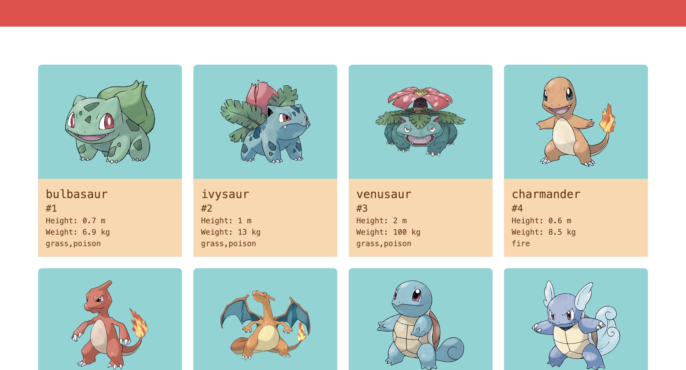

# Pokedex

Consumes the PokéAPI and displays information about the original 151 Pokémon.

Developed using Angular, and Tailwind CSS for ease of styling.

 


## Getting Started 
To run the project locally:

1. Clone the project:
    ```bash
    git clone <repository_url>
    cd path/to/pokedex
    ```

2. Ensure Angular CLI is installed

3. Run the project:
    ```bash
    npm install
    npm start 
    ```
    Navigate to `http://localhost:4200/`

## More Information
PokéAPI REST API Docs: https://pokeapi.co/docs/v2

This project was generated with [Angular CLI](https://github.com/angular/angular-cli) version 18.2.5.
